<p align="center">
  
</p>

<p align="center">
  <a href="https://pkg.go.dev/github.com/codewandler/axon"></a>
  <a href="https://goreportcard.com/report/github.com/codewandler/axon"></a>
  <a href="https://github.com/codewandler/axon/actions/workflows/ci.yml"></a>
  <a href="https://github.com/codewandler/axon/releases/latest"></a>
  <a href="LICENSE"></a>
</p>

<p align="center"><strong>AI-native graph database and indexing system — built for agents, runs locally.</strong></p>

<br/>

- 🗄️ **Graph storage** — typed nodes and edges with JSON data fields, labels, and full relationship tracking across sessions
- 🔍 **AQL** — Axon Query Language: SQL-style table queries, Cypher-inspired pattern matching, and variable-length path traversal, all in one unified syntax
- 📁 **Universal indexing** — filesystem, Git repositories, Markdown documents, and Go source code out of the box
- 🧠 **Context generation** — `axon context` finds the most relevant code for a task and fits it into an AI token budget automatically
- 🔎 **Semantic search** — vector similarity search via Ollama or Hugot, fully local with no external APIs
- 📡 **Watch mode** — live re-indexing on file changes with `axon index --watch`
- 🔒 **Local-first** — everything stored in a single SQLite file; no cloud, no data transmission

---

## Contents

- [For AI Agents](#-for-ai-agents)
- [Installation](#installation)
- [Quickstart](#quickstart)
- [AQL: Axon Query Language](#aql-axon-query-language)
- [CLI Reference](#cli-reference)
- [Go Library](#go-library)
- [Node Types](#node-types)
- [Edge Types](#edge-types)
- [Architecture](#architecture)
- [Use Cases](#use-cases)
- [License](#license)
- [Contributing](#contributing)

---

## 🤖 For AI Agents

Axon is built to be used directly by AI agents as a persistent knowledge tool. Copy and paste the prompt below into Claude, opencode, Cursor, or any agent to get started:

---

> You have access to **`axon`** — a graph-based knowledge CLI for AI agents that indexes your codebase into a queryable graph.
>
> **Step 1 — Install** (requires Go 1.25+):
> ```bash
> go install github.com/codewandler/axon/cmd/axon@latest
> ```
>
> **Step 2 — Build your skill.** Read and internalise the following files from this repository:
> - `README.md` — complete CLI and AQL reference
> - `.agents/skills/axon/SKILL.md` — compact command cheatsheet
> - `.agents/skills/axon/references/aql.md` — AQL syntax reference
> - `.agents/skills/axon/references/aql_go_querybuilder.md` — Go builder API (only if working in Go)
>
> **Step 3 — Index the project you're working on:**
> ```bash
> axon index .
> ```
>
> You can now query the graph with `axon query`, explore with `axon tree`, search with `axon find`, and generate context for tasks with `axon context`.

---

**opencode users**: the skill at `.agents/skills/axon/` is compatible with opencode and can be installed directly from this repository.

## Installation

```bash
go install github.com/codewandler/axon/cmd/axon@latest
```

Requires Go 1.25 or later.

## Quickstart

Initialize and index a directory:

```bash
# Index current directory (creates .axon/graph.db in the current directory)
axon index .

# Check what was indexed
axon tree

# Query for Go files
axon query "SELECT * FROM nodes WHERE type = 'fs:file' AND data.ext = 'go'"
```

Basic CLI commands:

- `axon index [path]` - Index a directory (alias: `axon init`)
- `axon index --embed [path]` - Index and generate embeddings for semantic search
- `axon index --watch [path]` - Watch for changes and keep graph up to date
- `axon query "<aql>"` - Execute AQL queries
- `axon tree [path]` - Display graph as tree
- `axon find` - Search nodes with flags (`--type`, `--name`, `--ext`, …)
- `axon find "<query>"` - Semantic similarity search (requires `--embed`)
- `axon show <node-id>` - Show node details
- `axon impact <symbol>` - Show blast radius of changing a symbol
- `axon context --task "<description>"` - Generate AI-optimised context for a task
- `axon info` - Database status and statistics dashboard
- `axon stats` - Database statistics

## AQL: Axon Query Language

AQL is a SQL-like query language with graph pattern matching. It supports both flat table queries and relationship traversal.

### Basic Table Queries

Query nodes and edges like traditional database tables:

```sql
-- All files
SELECT * FROM nodes WHERE type = 'fs:file'

-- Go files larger than 1KB
SELECT * FROM nodes 
WHERE type = 'fs:file' 
  AND data.ext = 'go' 
  AND data.size > 1000

-- Count nodes by type
SELECT type, COUNT(*) FROM nodes GROUP BY type
```

**JSON Field Access**: Use dot notation to query nested data:

```sql
SELECT * FROM nodes WHERE data.ext = 'go'
SELECT * FROM nodes WHERE data.size BETWEEN 100 AND 1000
SELECT * FROM nodes WHERE data.mode = 755
```

**Operators**: `=`, `!=`, `<`, `>`, `<=`, `>=`, `LIKE`, `GLOB`, `IN`, `BETWEEN`, `IS NULL`

**Label Operations**:

```sql
SELECT * FROM nodes WHERE labels CONTAINS ANY ('important', 'reviewed')
SELECT * FROM nodes WHERE labels CONTAINS ALL ('test', 'verified')
SELECT * FROM nodes WHERE labels NOT CONTAINS ('archived')
```

### Pattern Matching

Query the graph using Cypher-inspired patterns:

```sql
-- Files in directories
SELECT file FROM (dir:fs:dir)-[:contains]->(file:fs:file)

-- Go files in specific directory
SELECT file 
FROM (dir:fs:dir)-[:contains]->(file:fs:file)
WHERE dir.name = 'cmd' AND file.data.ext = 'go'

-- Branches in repositories
SELECT branch 
FROM (repo:vcs:repo)-[:has]->(branch:vcs:branch)
WHERE repo.name = 'myproject'
```

**Pattern Syntax**:

- `(var:type)` - Node with variable and type
- `->` - Outgoing edge
- `<-` - Incoming edge
- `-` - Undirected (either direction)
- `[var:type]` - Edge with variable binding

**Multi-Type Edges** (OR logic):

```sql
-- Match contains OR has edges
SELECT child FROM (parent)-[:contains|has]->(child)

-- Match any of three edge types
SELECT n FROM (root)-[:contains|has|references]->(n)
```

**Multiple Patterns** (implicit JOIN):

```sql
-- Files in repos located in specific dirs
SELECT file
FROM (repo:vcs:repo)-[:located_at]->(dir:fs:dir),
     (dir)-[:contains]->(file:fs:file)
WHERE repo.name = 'myrepo' AND file.data.ext = 'go'
```

### Variable-Length Paths

Traverse relationships recursively:

```sql
-- All descendants (1 or more hops)
SELECT desc FROM (root:fs:dir)-[:contains*]->(desc)

-- 1 to 3 hops deep
SELECT child FROM (parent:fs:dir)-[:contains*1..3]->(child)

-- Exactly 2 hops
SELECT node FROM (start)-[:contains*2]->(node)

-- At least 2 hops (unbounded)
SELECT desc FROM (root)-[:contains*2..]->(desc)

-- Multi-type recursive traversal
SELECT node FROM (root)-[:contains|has*1..5]->(node)
```

### Aggregation and Sorting

```sql
-- Count files per directory
SELECT dir.name, COUNT(*)
FROM (dir:fs:dir)-[:contains]->(file:fs:file)
GROUP BY dir.name
ORDER BY COUNT(*) DESC

-- Directories with many files
SELECT dir.name, COUNT(*)
FROM (dir:fs:dir)-[:contains]->(file:fs:file)
GROUP BY dir.name
HAVING COUNT(*) > 10

-- Top 10 largest files
SELECT name, data.size 
FROM nodes 
WHERE type = 'fs:file'
ORDER BY data.size DESC
LIMIT 10
```

### Existence Checks

Test for pattern existence without returning matches:

```sql
-- Directories containing Go files
SELECT dir
FROM (dir:fs:dir)
WHERE EXISTS (dir)-[:contains]->(:fs:file WHERE data.ext = 'go')

-- Repos with no branches
SELECT repo
FROM (repo:vcs:repo)
WHERE NOT EXISTS (repo)-[:has]->(:vcs:branch)
```

### Advanced Patterns

**Edge Variables**:

```sql
-- Examine edge properties
SELECT e.type, from.name, to.name
FROM (from)-[e:contains]->(to)
WHERE from.type = 'fs:dir'
```

**Inline WHERE Clauses**:

```sql
-- Filter inside patterns
SELECT file
FROM (dir:fs:dir WHERE dir.name = 'src')
     -[:contains]->
     (file:fs:file WHERE file.data.ext = 'go')
```

**Complex Boolean Logic**:

```sql
SELECT * FROM nodes
WHERE (type = 'fs:file' OR type = 'fs:dir')
  AND labels CONTAINS ANY ('important', 'reviewed')
  AND labels NOT CONTAINS ('archived')
  AND (data.size > 1000 OR data.size IS NULL)
```

## CLI Reference

### Global Flags

- `--db-dir <path>` - Use a specific database directory
- `--global` - Walk up from CWD to find an existing `.axon/graph.db`, then fall back to `~/.axon/graph.db`

**Database Resolution**: By default, axon uses `<cwd>/.axon/graph.db` — no directory traversal. Pass `--global` to search parent directories and fall back to `~/.axon/graph.db` if nothing is found locally.

### axon index

Index a directory and create the graph (alias: `axon init`):

```bash
axon index .                    # Index current dir → creates .axon/graph.db here
axon index --no-gc /path/to/dir # Skip garbage collection
axon index --embed .            # Index + generate embeddings for semantic search
```

**What gets indexed**:
- Filesystem structure (files, directories)
- Git repositories (repos, branches, tags, commits)
- Markdown documents (structure, sections, links)
- Go modules and packages (structs, interfaces, funcs, imports, implementations)

### axon query

Execute AQL queries:

```bash
# Basic query
axon query "SELECT * FROM nodes WHERE type = 'fs:file'"

# With output format
axon query --output json "SELECT * FROM nodes LIMIT 10"
axon query --output table "SELECT type, COUNT(*) FROM nodes GROUP BY type"
axon query --output count "SELECT * FROM nodes"

# See query execution plan
axon query --explain "SELECT file FROM (dir)-[:contains]->(file)"
```

### axon tree

Display the graph as a tree structure:

```bash
axon tree                      # Current directory subtree (depth 3, IDs + types shown by default)
axon tree /path/to/dir         # Specific path
axon tree nI3NDos              # Subtree rooted at node by ID prefix
axon tree --depth 2            # Limit depth (0 = unlimited; default 3)
axon tree --type fs:file       # Filter by node type (glob: 'fs:*', 'md:*')
axon tree --no-color           # Disable colored output
axon tree --no-emoji           # Disable emoji icons
```

### axon find

Search nodes with flags, or pass a text argument for semantic similarity search
(requires embeddings — run `axon index --embed` first):

```bash
# Semantic search
axon find "error handling"
axon find "concurrency and goroutines" --type go:func
axon find "recent logo commits"        --type vcs:commit --limit 5
axon find "storage interface design"   --type go:interface --global
axon find "error handling"             --output json

# Flag-only (unchanged)
axon find --type fs:file               # All files
axon find --name "main.go"             # Exact name match
axon find --ext go                     # By extension (repeatable: --ext go --ext py)
axon find --query "README*"            # Name wildcard pattern
axon find --label important            # By label (repeatable, OR logic)
axon find --data key=value             # Match on a data field
axon find --global                     # Search entire graph, not just CWD subtree
axon find --type vcs:branch --count    # Just show the count
axon find --output json                # Output format: path, uri, json, table
axon find --show-parent                # Show parent chain to CWD or root
axon find --show-query                 # Print the generated AQL query
axon find --limit 20                   # Limit number of results
```

### axon show

Display detailed node information:

```bash
axon show <node-id>            # Show node details
```

### axon context

Generate AI-optimised context for a task description — finds relevant definitions, dependencies, callers, and related symbols, then fits them within a token budget:

```bash
axon context --task "add caching to Storage interface"
axon context --task "refactor Query method" --tokens 8000
axon context --task "fix NewNode" --output json
axon context --task "explain Indexer" --no-source   # manifest only, no source
axon context --task "improve performance" --symbols Storage --symbols Query
echo "add error handling to Flush" | axon context   # task from stdin
```

### axon describe

Show the schema of the graph — all node types with counts, edge types with
from/to connection patterns, and (with `--fields`) the JSON data field names
stored on each node type. Useful for discovering what types and fields exist
before writing AQL queries or using `axon find --type`.

```bash
axon describe              # schema overview (text)
axon describe -o json      # machine-readable JSON
axon describe --fields     # include data field names per node type
```

### axon info

Show a dashboard of database status, location, statistics, and last index details:

```bash
axon info
axon info -o json
```

### Other Commands

```bash
axon stats                     # Database statistics
axon labels                    # List all labels with counts
axon types                     # List all node types with counts
axon edges                     # List all edge types with counts
axon gc                        # Run garbage collection
```

### Watch Mode

Keep the graph up to date as files change:

```bash
axon index --watch .                   # Watch current directory
axon index --watch ./src               # Watch specific subtree
axon index --watch --watch-quiet .     # Suppress per-change output
axon index --watch --watch-debounce 300ms .  # Custom debounce duration
axon index --watch --embed .            # Watch + re-embed on each change
```

On each file change, axon re-indexes the affected directory and prints:
```
↻  Re-indexed ./pkg/util — 12 files, 3 dirs (done)
```

### Impact Analysis

Understand the blast radius of changing a symbol:

```bash
axon impact Storage            # Show what depends on Storage
axon impact NewNode            # Show callers and importers
axon impact IndexResult        # Find all usages
```

Output:
```
Impact analysis: Storage (go:interface)

Direct references (17):
  adapters/sqlite               12 refs  [call, field, type]
  cmd/axon                       2 refs  [call]
  context                        3 refs  [type]

Packages importing affected packages:
  axon                  imports adapters/sqlite
  cmd/axon              imports sqlite, graph
```

### axon search (deprecated)

`axon search` is deprecated — use `axon find "<query>"` instead.

Semantic search is now built directly into `axon find`. Any positional text
argument triggers vector similarity search:

```bash
# Before (deprecated)
axon search --semantic "handles token budget overflow"
axon search --semantic "error recovery" --type go:func

# After
axon find "handles token budget overflow"
axon find "error recovery" --type go:func
```

### Embeddings

```bash
# First generate embeddings during indexing
axon index --embed .                              # uses Ollama by default
axon index --embed --embed-provider=hugot .       # in-process, no daemon needed

# Then search semantically via axon find
axon find "handles token budget overflow"
axon find "error recovery" --type go:func
axon find "storage interface" --limit 5
```

#### Provider: Ollama (default)

Requires the [Ollama](https://ollama.ai) daemon running locally.

```bash
ollama pull nomic-embed-text
axon index --embed .
```

#### Provider: Hugot (in-process, no daemon)

Runs ONNX sentence-embedding models fully inside the axon process.
No external service needed. Model is downloaded once (~90 MB) and cached.

```bash
# Hugot provider — downloads model on first run, then cached at ~/.axon/models/
axon index --embed --embed-provider=hugot .

# Custom model directory
axon index --embed --embed-provider=hugot --embed-model-path=/data/models/MiniLM .

# Via environment variable
AXON_EMBED_PROVIDER=hugot axon index --embed .
```

| | Hugot | Ollama |
|---|---|---|
| External daemon | ❌ none | ✅ required |
| CGO / shared libs | ❌ none | ❌ none |
| First-run setup | ~90 MB model download | `ollama pull <model>` |
| Throughput — single embed | ~114 ms (CPU, pure Go) | ~23 ms (GPU via HTTP) |
| Throughput — batched (32 nodes) | ~21 ms/node | ~12 ms/node |
| Best for | offline / CI / Docker | existing Ollama users |

Environment variables:
- `AXON_EMBED_PROVIDER` — provider name: `ollama` (default) or `hugot`
- `AXON_OLLAMA_URL` — Ollama base URL (default: `http://localhost:11434`)
- `AXON_OLLAMA_MODEL` — Ollama model name (default: `nomic-embed-text`)
- `AXON_HUGOT_MODEL` — HuggingFace repo slug (default: `KnightsAnalytics/all-MiniLM-L6-v2`)
- `AXON_HUGOT_MODEL_PATH` — local model directory (default: `~/.axon/models/<model>`)

## Go Library

Axon is available as an embeddable Go library.

```bash
go get github.com/codewandler/axon
```

### Index and Query

`axon.New` returns an `*Axon` that handles both indexing and querying:

```go
import (
    "context"
    "fmt"
    "log"

    axon "github.com/codewandler/axon"
    "github.com/codewandler/axon/aql"
    "github.com/codewandler/axon/graph"
)

func main() {
    ax, err := axon.New(axon.Config{Dir: "."})
    if err != nil {
        log.Fatal(err)
    }

    ctx := context.Background()
    if _, err := ax.Index(ctx, "."); err != nil {
        log.Fatal(err)
    }

    // AQL string — parse + execute in one call
    result, err := ax.QueryString(ctx, `SELECT type, COUNT(*) FROM nodes GROUP BY type ORDER BY COUNT(*) DESC`)
    if err != nil {
        log.Fatal(err)
    }
    for _, c := range result.Counts {
        fmt.Printf("%s: %d\n", c.Name, c.Count)
    }

    // Builder API — type-safe, no strings
    q := aql.Nodes.Select(aql.Type, aql.Count()).
        Where(aql.Type.Glob("go:*")).
        GroupBy(aql.Type).
        OrderByCount(true).
        Build()
    result, err = ax.Query(ctx, q)

    // Structural filter
    nodes, err := ax.Find(ctx, graph.NodeFilter{Type: "go:func"}, graph.QueryOptions{Limit: 20})
    for _, n := range nodes {
        fmt.Println(n.Name)
    }
}
```

### Writing Nodes

Use `WriteNode` to persist a custom node, flush it to storage, and automatically
embed it (if an `EmbeddingProvider` is configured) — all in one call:

```go
node := graph.NewNode("memory:decision").
    WithName("Use PostgreSQL for user data").
    WithURI("memory:decision:db-choice").       // same URI = upsert
    WithData(map[string]any{"reason": "JSONB support and familiarity"}).
    WithLabels("architecture", "reviewed")

if err := ax.WriteNode(ctx, node); err != nil {
    log.Fatal(err)
}

// Node is immediately queryable and searchable:
nodes, _ := ax.Find(ctx, graph.NodeFilter{Type: "memory:decision"}, graph.QueryOptions{})
got, _   := ax.GetNodeByURI(ctx, "memory:decision:db-choice")
```

For bulk writes where you want to control the flush boundary yourself, use
`PutNode` + `Flush`:

```go
for _, n := range batch {
    _ = ax.PutNode(ctx, n)
}
_ = ax.Flush(ctx)
```

### Semantic Search

Pass an `EmbeddingProvider` in `Config` to enable semantic search. `WriteNode`
will automatically embed custom nodes so they appear in search results immediately:

```go
import "github.com/codewandler/axon/indexer/embeddings"

ax, _ := axon.New(axon.Config{
    Dir:               ".",
    EmbeddingProvider: embeddings.NewOllama("", "", 0),
})
ax.Index(ctx, ".")

// Search with options— MinScore trims noise without a manual post-filter loop.
results, err := ax.Search(ctx, []string{"authentication logic"}, axon.SearchOptions{
    Limit:    10,
    MinScore: 0.5,
})

// Scope to a type (applies the correct URI scheme automatically).
results, err = ax.Search(ctx, []string{"token budget"}, axon.SearchOptions{
    Limit:  5,
    Filter: &graph.NodeFilter{
        Type:      "go:func",
        URIPrefix: types.URIPrefixForType("go:func"), // infers CWD
    },
})
```

### URI Prefix Scoping

`types.URIPrefixForType` maps a node type to the correct URI scheme for local
scoping. Each indexer uses a different scheme, so the prefix must match:

```go
import "github.com/codewandler/axon/types"

// Explicit directory
prefix := types.URIPrefixForType("go:func", "/home/user/myrepo")
// go+file:///home/user/myrepo

// Infer from current working directory
prefix = types.URIPrefixForType("vcs:commit")
// git+file:///current/working/dir

// Scheme mapping:
// go:*   → go+file://
// vcs:*  → git+file://
// md:*   → file+md://
// fs:*, * → file://
```

### The `Querier` Interface

`*Axon` satisfies `axon.Querier`, so you can depend on the interface in your
own code for easier testing and decoupling:

```go
func printNodeTypes(ctx context.Context, q axon.Querier) error {
    result, err := q.QueryString(ctx, "SELECT type, COUNT(*) FROM nodes GROUP BY type")
    if err != nil {
        return err
    }
    for _, c := range result.Counts {
        fmt.Printf("%s: %d\n", c.Name, c.Count)
    }
    return nil
}

printNodeTypes(ctx, ax)
```

`Querier` exposes:

| Method | Description |
|--------|-------------|
| `Query(ctx, *aql.Query)` | Execute a pre-built AQL query (from the builder or `aql.Parse`) |
| `QueryString(ctx, string)` | Parse an AQL string and execute it in one call |
| `Explain(ctx, *aql.Query)` | Return the execution plan without running the query |
| `Find(ctx, NodeFilter, QueryOptions)` | Structural node filter search |
| `Search(ctx, queries, SearchOptions)` | Semantic similarity search (requires embedding provider) |

### Watch Mode

Keep the graph live with `(*Axon).Watch`:

```go
err := ax.Watch(ctx, ".", axon.WatchOptions{
    OnReady: func(result *axon.IndexResult, err error) {
        fmt.Printf("ready: %d files\n", result.Files)
    },
    OnReindex: func(path string, result *axon.IndexResult, err error) {
        fmt.Printf("re-indexed %s\n", path)
    },
})
```

## Node Types

Axon uses typed nodes with `domain:name` format:

### Filesystem

- `fs:file` - File node
  - Data: `ext` (extension), `size` (bytes), `mode` (permissions)
- `fs:dir` - Directory node

### Version Control

- `vcs:repo` - Git repository
- `vcs:remote` - Git remote
- `vcs:branch` - Branch
- `vcs:tag` - Tag
- `vcs:commit` - Commit

### Documents

- `md:document` - Markdown document
- `md:section` - Document section (heading-based; `data.level` = 1–6)
- `md:codeblock` - Fenced code block
- `md:link` - External link
- `md:image` - Image reference

### Go Code

- `go:module` - Go module (go.mod root)
- `go:package` - Go package
- `go:func` - Function or method
- `go:method` - Method on a type
- `go:struct` - Struct type
- `go:field` - Struct field
- `go:interface` - Interface type
- `go:const` - Constant
- `go:var` - Package-level variable
- `go:ref` - Symbol reference (call site, type usage, etc.)

### Project

- `project:root` - Project root detected from a manifest file (go.mod, package.json, Cargo.toml, etc.)
  - Data: `type` (language: go, node, rust, python, java, ruby, php), `name`, `version`, `dep_count`

## Edge Types

Common edge types follow generic semantics:

- `contains` / `contained_by` - Structural containment (dir → file)
- `has` / `belongs_to` - Logical ownership (repo → branch)
- `located_at` - Physical location (repo → dir)
- `references` - Soft cross-reference
- `links_to` - Explicit hyperlink
- `depends_on` - Dependency relationship
- `imports` - Import statement (go:package → go:package)
- `implements` - Struct implements interface (go:struct → go:interface)
- `tests` - Test package tests source package (go:package → go:package)
- `defines` - Package defines symbol (go:package → go:func/struct/etc.)
- `parent_of` - Commit DAG parent-to-child (vcs:commit → vcs:commit)
- `modifies` - Commit modified a file (vcs:commit → fs:file)

## Architecture

Axon consists of:

- **Graph Core** (`graph/`) - Node, Edge, Storage interface
- **SQLite Adapter** (`adapters/sqlite/`) - Persistent storage with buffered writes
- **AQL Engine** (`aql/`) - Parser, AST, query compiler
- **Indexers** (`indexer/`) - Pluggable indexers for different data sources
  - `fs` - Filesystem indexer
  - `git` - Git repository indexer
  - `markdown` - Markdown document indexer
  - `golang` - Go source code indexer
  - `project` - Project manifest indexer (go.mod, package.json, …)
  - `tagger` - Rule-based label tagger (applies labels by name/path pattern)
  - `embeddings` - Embedding providers (Ollama, Hugot, null)
- **Context Engine** (`context/`) - Token-budget-aware context gathering for AI agents
- **CLI** (`cmd/axon/`) - Command-line interface
- **TUI** (`cmd/axontui/`) - Terminal UI explorer

**Key Features**:

- Generation-based garbage collection (tracks stale nodes across index runs)
- Event-driven cascade deletion (when files are deleted, dependent data is cleaned up)
- Buffered writes for performance (5000 items or 100ms batches)
- Pluggable indexer architecture (subscribe to events, handle specific URI schemes)

## Use Cases

**For AI Agents**:

- Persistent memory across sessions
- Context-aware file retrieval
- Relationship tracking (imports, dependencies, references)
- Structured knowledge graphs from unstructured data
- Multi-hop reasoning (variable-length paths)

**For Developers**:

- Code navigation and exploration
- Dependency analysis
- Git history queries
- Documentation cross-referencing
- Project structure understanding

## License

MIT

## Contributing

Contributions welcome! See the codebase structure in `AGENTS.md` for development guidelines.
